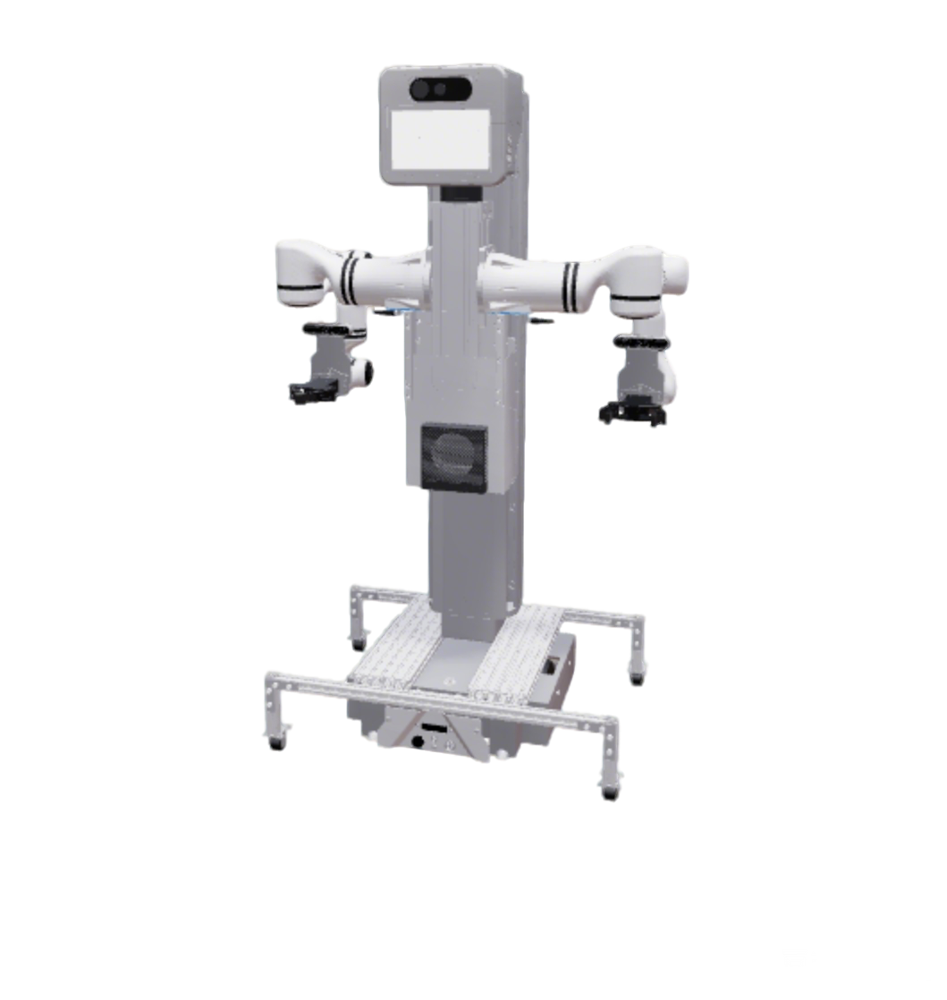
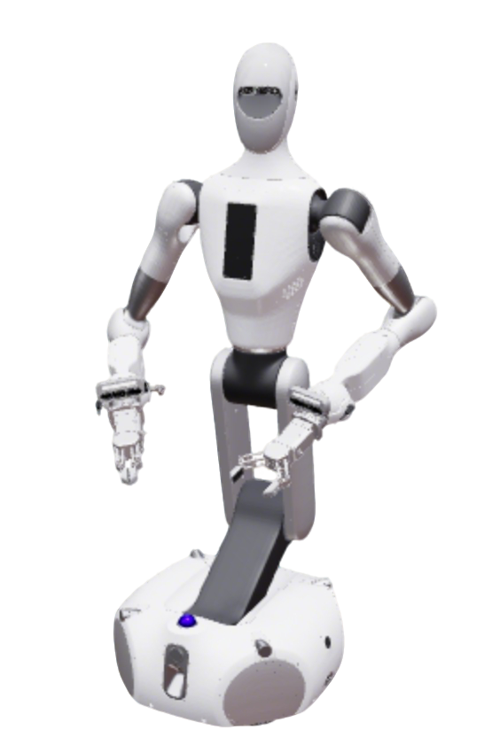
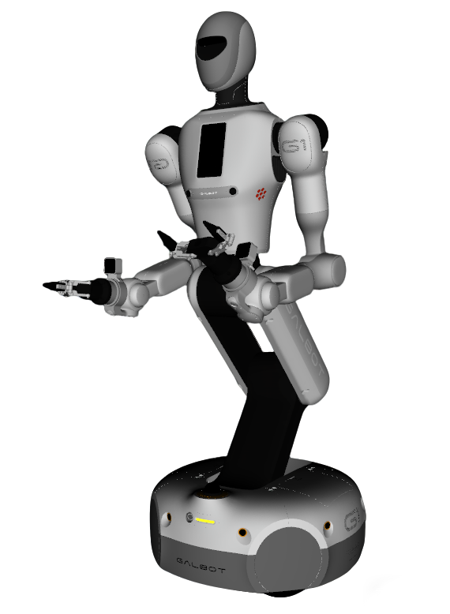
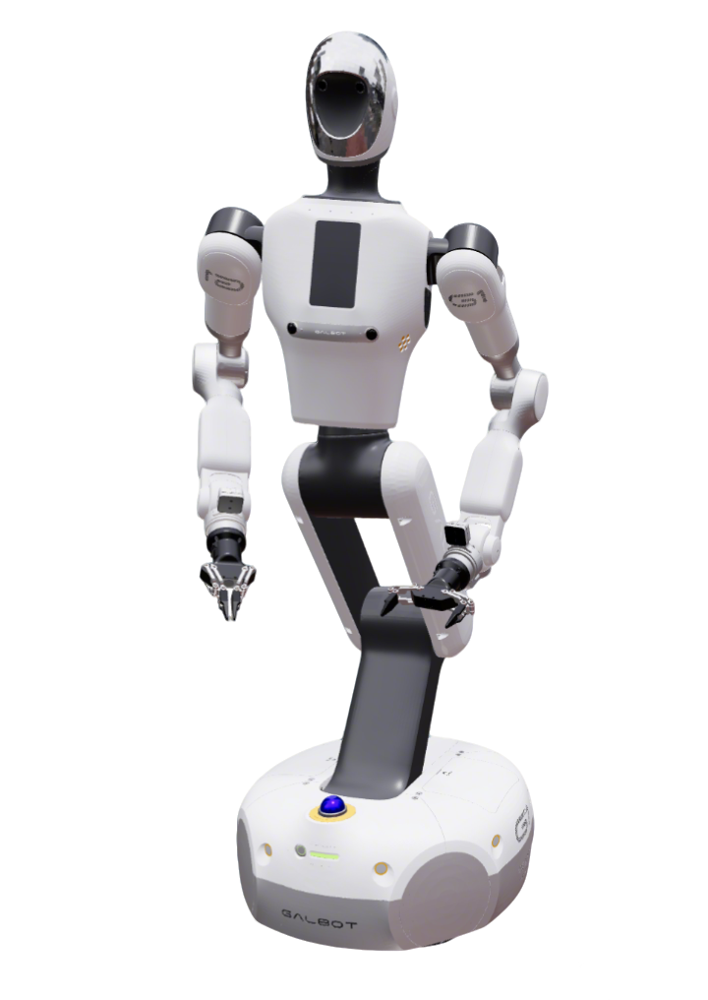
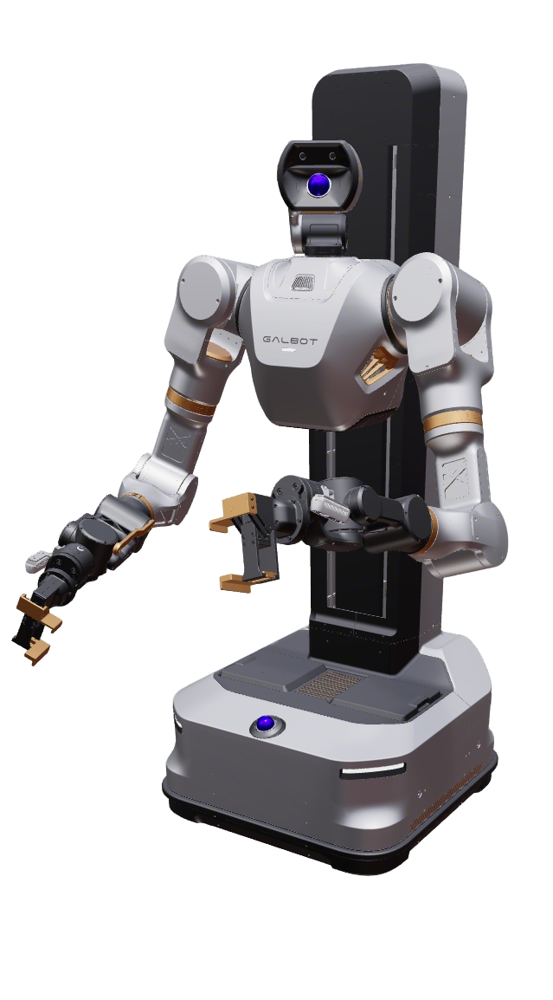

# Galbot Robots

Galbot humanoid robot description packages. Each package contains its own URDF/Xacro, meshes, RViz, and controller configuration.

| Brand | Model | Repaint | Images |
|---|---|---|---|
| Galbot | [Zero](galbot_zero_description/) | Yes |  |
| Galbot | [One](galbot_one_description/) | Yes |  |
| Galbot | [One Charlie](galbot_charlie_description/) | Yes |  |
| Galbot | [G1 Foxtrot](galbot_foxtrot_description/) | Yes |  |
| Galbot | [G1 Golf](galbot_golf_description/) | Yes |  |
| Galbot | [S1](galbot_s1_description/) | Yes |  |

## Common Commands

### Build

```bash
cd ~/ros2_ws
colcon build --packages-up-to <package> --symlink-install
source ~/ros2_ws/install/setup.bash
```

### Visualize Full Robot

```bash
ros2 launch robot_common_launch manipulator.launch.py robot:=<robot>
```

Useful arguments:

- `robot:=<robot>` selects the robot, for example `galbot_s1` or `galbot_foxtrot`.
- `type:=none` hides optional end effectors when the model supports it.
- `type:=hitbot` or `type:=galbot_gripper` selects a gripper variant when available.
- `collider:=simple` is the default on most models and uses simple primitive collision geometry. Some models also support `convex_decomposition` for convex-hull collision meshes.

### Visualize Component

```bash
ros2 launch robot_common_launch component.launch.py robot:=<robot> type:=<component>
```

Common component values include `chassis`, `body`, `head`, `arm`, and gripper-specific entries such as `left_gripper` or `right_gripper`. The exact list is model-specific.

### Run OCS2 Demos

The default hardware is `mock_components`.

```bash
ros2 launch robot_common_launch manipulator_ocs2.launch.py robot_name:=<robot>
ros2 launch ocs2_arm_controller full_body.launch.py robot:=<robot>
ros2 launch ocs2_arm_controller split_body.launch.py robot:=<robot>
```

`manipulator_ocs2.launch.py` is the official mobile manipulator demo. `full_body.launch.py` and `split_body.launch.py` are arm controller demos. Add `hardware:=isaac` for Isaac Sim where supported; otherwise the launch uses mock components. Navigation examples and model-specific OCS2 or gripper commands live in each package README.

## Packages

```text
Galbot/
├── galbot_zero_description/
├── galbot_one_description/
├── galbot_charlie_description/
├── galbot_foxtrot_description/
├── galbot_golf_description/
└── galbot_s1_description/
```
