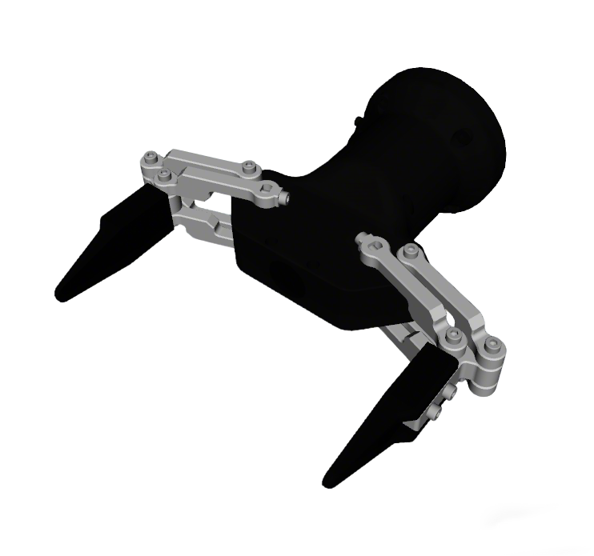
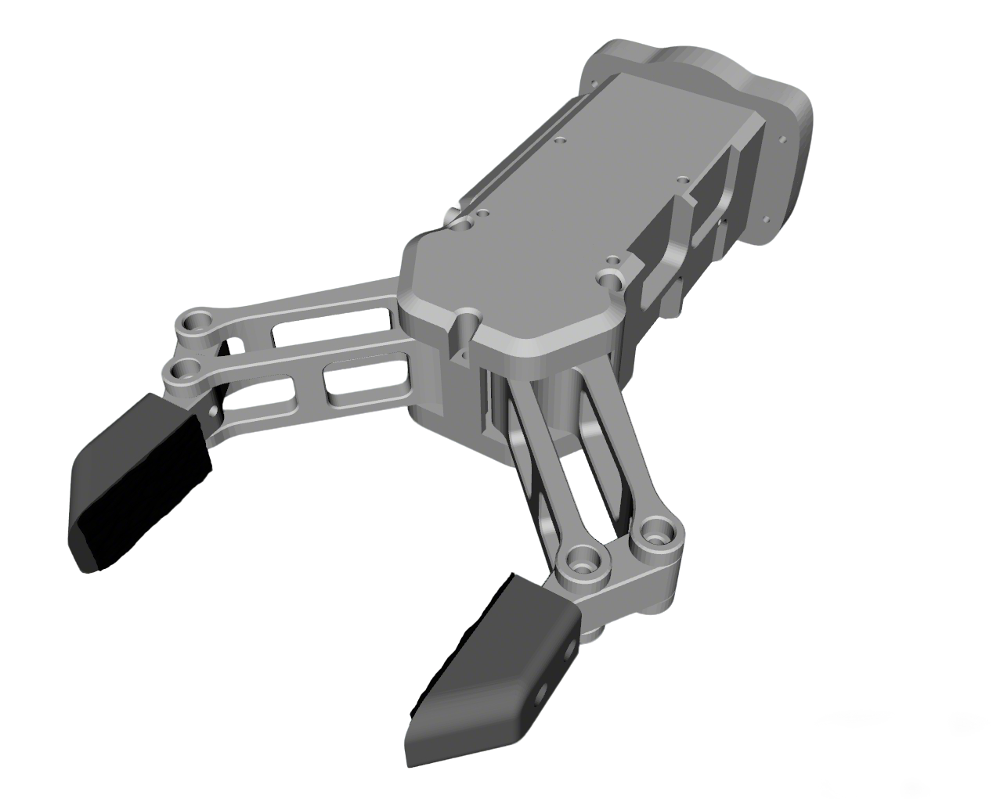

# Galbot G1(foxtrot) Description

This package contains the description files for Galbot G1(foxtrot) humanoid. The origin models could be found at [Galbot IOAI](https://github.com/galbot-ioai/physics_sim_edu).

Robot models are defined under **`xacro/`** only (no static `urdf/`). `robot_common_launch` and OCS2 expand `xacro/robot.xacro` at runtime.

## 1. Build
```bash
cd ~/ros2_ws
colcon build --packages-up-to galbot_foxtrot_description --symlink-install
```

## 2. Visualize the robot

### 2.1. Full robot

* Galbot Foxtrot Robot (Default)
  ```bash
  source ~/ros2_ws/install/setup.bash
  ros2 launch robot_common_launch manipulator.launch.py robot:=galbot_foxtrot
  ```
      
  

* Galbot Foxtrot Robot with Hitbot Gripper
  ```bash
  source ~/ros2_ws/install/setup.bash
  ros2 launch robot_common_launch manipulator.launch.py robot:=galbot_foxtrot type:=hitbot
  ```

* Left Hitbot + Right Suction Cup (mixed end effectors)
  ```bash
  source ~/ros2_ws/install/setup.bash
  ros2 launch robot_common_launch manipulator.launch.py robot:=galbot_foxtrot \
    left_type:=hitbot right_type:=suction_cup
  ```


### 2.2. Component modules

* Wheel
  ```bash
  source ~/ros2_ws/install/setup.bash
  ros2 launch robot_common_launch component.launch.py robot:=galbot_foxtrot type:=wheel
  ```

* Chassis
  ```bash
  source ~/ros2_ws/install/setup.bash
  ros2 launch robot_common_launch component.launch.py robot:=galbot_foxtrot type:=chassis
  ```

* Head
  ```bash
  source ~/ros2_ws/install/setup.bash
  ros2 launch robot_common_launch component.launch.py robot:=galbot_foxtrot type:=head
  ```

* Arms
  ```bash
  source ~/ros2_ws/install/setup.bash
  ros2 launch robot_common_launch component.launch.py robot:=galbot_foxtrot type:=arm
  ```
* Galbot Gripper
  ```bash
  source ~/ros2_ws/install/setup.bash
  ros2 launch robot_common_launch gripper.launch.py gripper:=galbot_foxtrot
  ```
  
* Hitbot Gripper
  ```bash
  source ~/ros2_ws/install/setup.bash
  ros2 launch robot_common_launch gripper.launch.py gripper:=galbot_foxtrot type:=hitbot
  ```
  


### 3. Official OCS2 Mobile Manipulator Demo

* Galbot Gripper (Default)
```bash
source ~/ros2_ws/install/setup.bash
ros2 launch robot_common_launch manipulator_ocs2.launch.py robot_name:=galbot_foxtrot
```

* Hitbot Gripper
```bash
source ~/ros2_ws/install/setup.bash
ros2 launch robot_common_launch manipulator_ocs2.launch.py robot_name:=galbot_foxtrot type:=hitbot
```

[Screencast from 2025-08-29 18-01-39.webm](https://github.com/user-attachments/assets/d9c63f0a-4b28-45b2-a046-77b3883a7504)


### 4. OCS2 Arm Controller Demo

* Galbot Gripper (Default)
```bash
source ~/ros2_ws/install/setup.bash
ros2 launch ocs2_arm_controller full_body.launch.py robot:=galbot_foxtrot
```

* Hitbot Gripper
```bash
source ~/ros2_ws/install/setup.bash
ros2 launch ocs2_arm_controller full_body.launch.py robot:=galbot_foxtrot type:=hitbot
```

* Left Hitbot + Right Suction Cup (mixed end effectors, mock)
```bash
source ~/ros2_ws/install/setup.bash
ros2 launch ocs2_arm_controller full_body.launch.py robot:=galbot_foxtrot \
  left_type:=hitbot right_type:=suction_cup
```

* Isaac (Default)
```bash
source ~/ros2_ws/install/setup.bash
ros2 launch ocs2_arm_controller full_body.launch.py robot:=galbot_foxtrot hardware:=isaac
```

* Isaac + Hitbot
```bash
source ~/ros2_ws/install/setup.bash
ros2 launch ocs2_arm_controller full_body.launch.py robot:=galbot_foxtrot type:=hitbot hardware:=isaac
```

### 5. Isaac Navigation

```bash
source ~/ros2_ws/install/setup.bash
ros2 launch robot_common_launch navigation_isaac_gt.launch.py robot:=galbot_foxtrot map:=warehouse_multiple_shelfs nav2_profile:=map_only
```